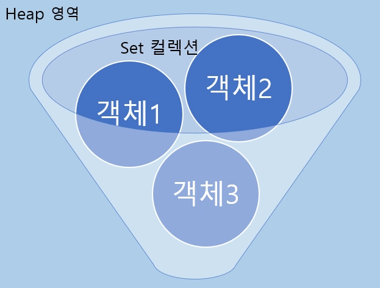
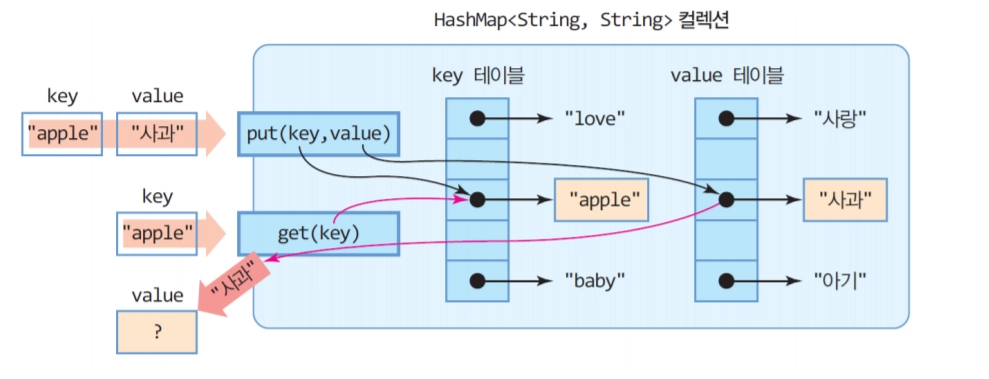

# 4. 자료구조

자료구조는 데이터를 저장하고 관리하는 방식

→ 같은 데이터를 저장하더라도 어떤 자료구조를 사용하느냐에 따라 프로그램의 실행 속도가 달라질 수 있다

## HashSet

값을 중복 없이 저장하는 자료구조



Set 인터페이스의 구현 클래스

→ Set은 **객체를 중복해서 저장할 수 없고** 하나의 null 값만 저장 가능

```java
import java.util.HashMap;

Set<Integer> set = new HashSet<>();
set.add(1);
set.add(2);
set.add(2);

System.out.println(set); // [1, 2]
System.out.println(set.size()); // 2
```

→ `2`를 두 번 추가했지만 중복된 값은 저장되지 않는다

### **주요 특징**

- 같은 값을 중복해서 저장할 수 없다.
- 특정 값의 존재 여부를 빠르게 확인할 수 있다.
- 인덱스가 없다.
- 저장 순서가 보장되지 않는다

### 주요 메서드

| 메서드 | 기능 |
| --- | --- |
| `add(value)` | 값 추가 |
| `contains(value)` | 값의 존재 여부 확인 |
| `remove(value)` | 값 삭제 |
| `size()` | 저장된 값의 개수 |
| `isEmpty()` | 비어 있는지 확인 |
| `clear()` | 모든 값 삭제 |

---

## HashMap



데이터를 **Key와 Value의 한 쌍**으로 저장하는 자료구조

→ Key를 사용해 그 Key에 연결된 Value를 빠르게 찾을 수 있다

```java
Map<String, Integer> map = new HashMap<>();

map.put("Kim", 90);
map.put("Lee", 80);

System.out.println(map.get("Kim")); // 90
```

### 주요 특징

- 하나의 Key에 하나의 Value가 연결된다.
- Key는 중복될 수 없다.
- Value는 중복될 수 있다.
- 같은 Key로 다시 저장하면 기존 Value가 덮어써진다.
- 저장 순서가 보장되지 않는다.

### 주요 메서드

| 메서드 | 기능 | 예시 |
| --- | --- | --- |
| `put(key, value)` | Key와 Value 저장,
같은 키 넣으면 기존 거 교체 | `map.put("Kim", 90)` |
| `get(key)` | Key에 해당하는 Value 조회,
없으면 null 반환 | `map.get("Kim")` |
| `getOrDefault(key, defaultValue)` | Key가 없으면 기본값 반환 | `map.getOrDefault("Kim", 0)` |
| `containsKey(key)` | Key의 존재 여부 확인 | `map.containsKey("Kim")` |
| `remove(key)` | Key와 Value 삭제 | `map.remove("Kim")` |
| `size()` | 저장된 Key-Value 쌍의 개수 | `map.size()` |
| `isEmpty()` | 비어 있는지 확인 | `map.isEmpty()` |
| `clear()` | 모든 데이터 삭제 | `map.clear()` |
| `keySet()` | 모든 Key 반환 | `map.keySet()` |
| `entrySet()` | 모든 Key-Value 쌍 반환 | `map.entrySet()` |

#### getOrDefualt()

**코테에서 값의 등장 횟수를 셀 때 매우 자주 사용!**

```java
String[] names = {"Kim", "Lee", "Kim"};

Map<String, Integer> count = new HashMap<>();

for (String name : names) {
		count.put(name, count.getOrDefault(name, 0) + 1);		
}
// Kim → 2
// Lee → 1
```

---

## HashSet과 HashMap의 차이

둘 다 해시를 이용하지만 저장하는 데이터와 사용 목적이 다르다

| 자료구조 | 저장 형태 | 중복 불가 대상 | 주요 목적 |
| --- | --- | --- | --- |
| `HashSet` | 값 | 값 | 중복 제거, 존재 여부 확인 |
| `HashMap` | Key → Value | Key | Key에 연결된 정보 저장 |

**있는지만 확인하려면 `HashSet`,  연결된 값까지 필요하면 `HashMap`을 사용**

---

---

## hashCode()와 equals()

해시 기반 자료구조가 객체를 저장하거나 찾을 때는 일반적으로 다음 과정을 거친다

1. 객체의 hashCode()를 이용해 버킷을 찾는다.
2. 같은 버킷에 있는 객체와 equals()로 비교한다.
3. equals()가 true이면 같은 객체로 취급한다.

### hashCode()

`hashCode()`는 객체를 어느 버킷에서 찾아야 하는지 빠르게 결정하기 위한 정숫값을 반환한다.

### equals()

`equals()`는 두 객체가 논리적으로 같은 객체인지 최종적으로 판단한다.

```java
hashCode() → 후보 위치 찾기
equals()   → 실제 동일 여부 확인
```

`hashCode()`만으로 같은 객체인지 판단하지 않는 이유는 서로 다른 객체가 같은 해시값을 가질 수 있기 때문이다. 이를 **해시 충돌(Hash Collision)**이라고 한다.

```
객체 A ─┐
        ├─ 같은 hashCode()를 가질 수 있음
객체 B ─┘
```

따라서 다음 규칙이 중요하다.

- `equals()`가 `true`인 두 객체는 반드시 같은 `hashCode()`를 가져야 한다.
- `hashCode()`가 같다고 해서 반드시 `equals()`가 `true`인 것은 아니다.

## 객체 비교: ==와 equals()

객체에서 `==`는 두 변수가 같은 객체 주소를 가리키는지 비교한다.

`equals()`는 재정의 방식에 따라 객체의 내용을 비교할 수 있다.

```java
CountableWord a = new CountableWord("apple");
CountableWord b = new CountableWord("apple");

System.out.println(a == b);      // false
System.out.println(a.equals(b)); // 재정의했다면 true
```

`a`와 `b`는 서로 다른 객체이므로 주소는 다르다.

**하지만 내부의 `word` 값이 같으면 같은 단어로 취급하도록 `equals()`를 재정의할 수 있다.**

```java
@Override
public boolean equals(Object o) {
    if (!(o instanceof CountableWord)) {
        return false;
    }

    CountableWord other = (CountableWord) o;
    return this.word.equals(other.word);
}

@Override
public int hashCode() {
    return Objects.hash(this.word);
}
```

`equals()`는 객체의 주소가 아니라 내부의 `word`가 같은지 비교한다.